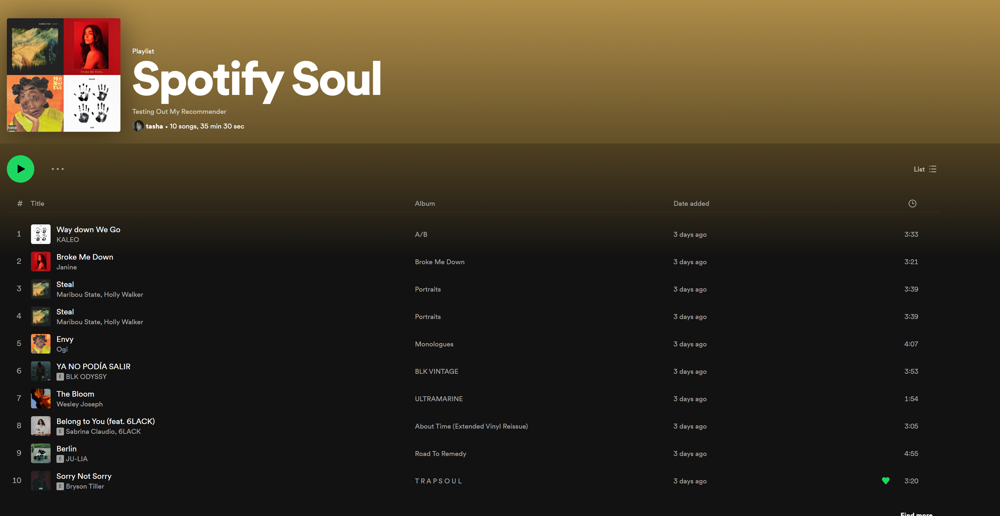

# Spotify Soul Recommender

This machine learning project creates a personalized soulful playlist based on the soulful songs you already have in your favorites. Assuming you're into that kind of vibe :)

## How It Works

This works by filtering your Top 50 Tracks by genre, specifically looking for songs that fit these genres: 'contemporary', 'r&b', 'lofi', 'soul', 'jazz', 'neo', 'blue', 'chillwave', 'lo-fi', 'chill', 'soul'.

The features of these songs will help the model identify what kind of soulful music you enjoy. Once the model is trained and ready to be used. It will sort through a list of over 2000 soulful songs and reccommend 10 songs to add to your new Spotify Soul playlist. 


## Requirements
- Python 3.8+
- Spotipy
- Pandas
- Scikit-learn (for the machine learning model)
- Your Spotify API credentials

## Setup
Please read the whole setup section before you clone the project to avoid errors

### 1. Clone the Repository

```bash
git clone https://github.com/yourusername/spotify-soul-recommender.git
cd spotify-soul-recommender
```

### 2. Install Dependencies

Make sure you have Python 3.8 or higher installed. Install poetry if you don't already have it. 

```bash
pip install poetry
```
Install dependencies using poetry
```bash
poetry install --no-root
```

### 3. Configure Spotify API Credentials

1. Visit the [Spotify Developer Dashboard](https://developer.spotify.com/dashboard/).
2. Create a new app to get your `clientId` and `clientSecret`.
3. Edit the `credentials.py` file (you will create this in the next step) with your Spotify username, `clientId`, `clientSecret`, and `redirectUri`.

```python
# credentials.py
clientId = 'your_spotify_client_id'
clientSecret = 'your_spotify_client_secret'
redirectUri = 'your_app_redirect_uri'
username = 'your_spotify_username'
```

### 4. Run the Scripts
This assumes that you'll be using the `reccommended_library.csv` provided for this project instead of creating a new dataset of over 7000+ songs 

Run the `app.py` script using this command in your terminal.
```bash
python ./app.py
```
If you want to create your own dataset from stratch undo the commenting out in the main function of `app.py`:
```python
#THIS WILL CREATE A DATASET OF OVER 7000+ SONGS, DO NOT RUN THIS IF YOU ARE USING THIS PROVIDED DATASET: reccomendations_library.csv
# Process to create the library of tracks - run this once then comment it out. 
keywords = {'contemporary', 'r&b', 'lofi', 'soul', 'jazz', 'neo soul', 'blues', 'chillwave', 'lo-fi', 'chill', 'soul'}
playlistIds = initialiseDataset.FindSoulfulPlaylists(sp, keywords)
allTrackIds = initialiseDataset.GetTracksFromPlaylist(sp, playlistIds)
with open('track_ids.txt', 'w') as file:
    for Id in allTrackIds:
    file.write(Id + '\n')
getFeatures.CreateLibrary(sp, 'track_ids.txt', 'track_processing_progress.txt')
```
### WARNING:
You may encounter multiple rate limit errors from the Spotify Client. If this happens wait around 24 hours before running that section of `app.py` again.
`getFeatures.py` keeps track of where it last stopped before the error so it will pick up from where it left off. 
`getFeatures.py` has also implemented a wait time of around 30 seconds between processing each batch of track IDs.
track IDs are processed in batches of 100 to help with the ratelimit issue.  

### Sample Output

